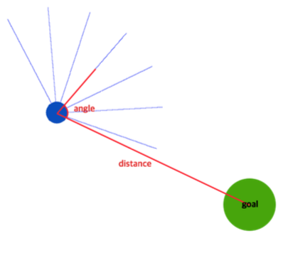
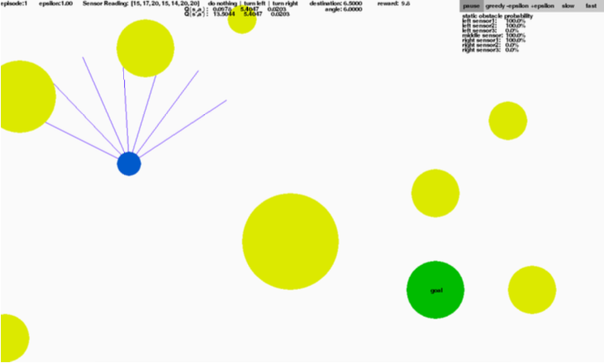

# Reinforcement Learning Robot Simulation using Tensorflow
In this project, the robot(agent) avoids static/dynamic obstacles in the environment.  

The blue robot has no prior knowledge of the environment. It doesn't know where the obstacles are. It uses seven sensors(e.g. ultrasonic/laser) to detect its surroundings, and uses these measured information to make decisions(move forward, turn left/right).  

There are two different goals:
First is to avoid obstacles in the environment like in the figure below  

Second is to avoid obstacles and reach to the goal like in the figure below  

To run the project, follwing requriements should be installed:  
-pygame [installation](http://www.pygame.org/lofi.html)  
-matplotlib [installation](http://matplotlib.org/users/installing.html)  
-numpy [installation](https://docs.scipy.org/doc/numpy/user/install.html)  
-tensorflow [installation]()

##Running in static environment
$ python2.7 static test.py

###Screenshot

##Running in dynamic environment 
$ python2.7 dynamic test.py

###Screenshot

